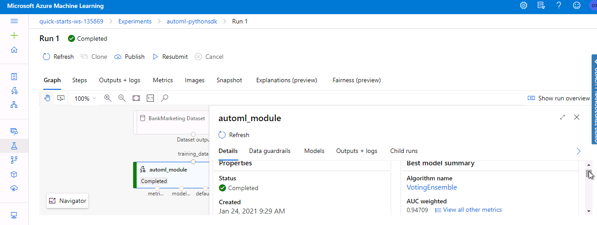
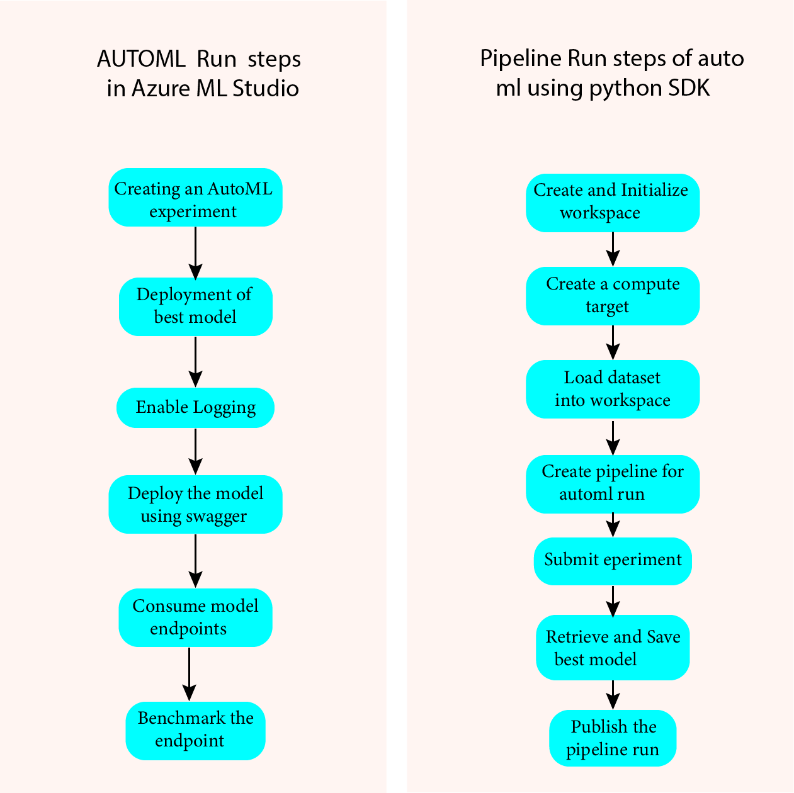

# Operationalizing Machine Learning

## Index
* 1.1 Overview of the project
* 1.2 Architectural Diagram
* 1.3 Key Steps
* 1.4 Screen Recording
* 1.5 Standout Suggestions
* 1.6 Screenshots

## 1.1 Overview of the project
This project uses Bankmarketing Dataset. We configure a cloud based machine learning model that is deployed and consumed followed by creating, publishing and consuming a pipeline.

* In the first part of the project, we create and run AutoML experiment through Azure Machine Learning studio.
* The automl run through ml studio with best model is deployed and consumed.
* The second part shows python sdk using jupyter notebook to create AutoML run through pipeline class.
* The pipeline run is published and consumed after completion.

* The best model summary for AutoML run in ML studio is **Voting Ensemble** with an accuracy of 0.91927.
* The best model summary produced by automl module for pipeline run is **Voting Ensemble** with an AUC weighted of 0.94709.

## 1.2 Architectural Diagram

## 1.3 Key Steps

### Step 1: Creating an AutoML experiment
Create a new AutoML run by uploading and register of Bankmarketing Dataset followed by configuration of new compute cluster(Standard_DS12_v2) and run the experiment using Classification by enabling Explain best model parameter.

### Step 2: Deployment of best model
After the experiment ends, best model from models tab is selected for deployment. The best model is deployed using Azure Container Instance by enabling Authentication.

### Step 3: Enabling Logging
Enable application insights and retrieve logs by running logs.py script. Service gets updated and Application insights get enabled to True in Details tab for the endpoint.

### Step 4: Consume deployed model using Swagger
Now Swagger URI is obtained for the endpoint model that contains swagger.json file. We use swagger shell script that runs Docker and pulls the swagger API followed by running swaaggerui on the port where all these are done locally so as to interact with swagger documentation. Run swagger.sh using bash command which starts running docker and run localhost in browser after executing serve.py script which provides HTTP server on a given port that shows swagger documentation for the model endpoint API present in azureml studio.

### Step 5: Consume model endpoints
Consume the model endpoint by running enpoint.py script after replacing scoring URI with REST endpoint URL and primary key that was generated after deployment under consume tab of endpoints section. This script provides a json output as response result. 

### Step 6: Benchmark the endpoint using Apache bench
Use Apache Benchmark for benchmarking HTTP services by running benchmark.sh script to retrieve performance results like average response time for deployed model and enables timeout of server if it cannot produce response in a given amount of time.

### Step 7: Create, Publish and Consume a Pipeline
This notebook demonstrates the use of AutoML step in Azure Machine Learning Pipeline.
* Using python sdk specific imports and create Workspace.
* Create a compute target and load the dataset.
* Use AutoML config to train and create pipeline for Automl run and submit pipeline experiment.
* Retrieve and save best model from pipeline run.
* Test the model using best fitted model by loading test data.
* Publishing the pipeline which enables a REST endpoint to run the pipeline from any HTTP library on any platform.
* Consume the pipeline endpoint by making a request.

## 1.4 Screen Recording
The screencast video is present in files with name "**project video.mp4**".

## 1.5 Standout Suggestions
Used Apache Benchmark to benchmark the endpoint that evaluates and shows the performance results. Benchmark runs against HTTP API successfully.

# 1.6 Screenshots

1. ML studio showing the **Registered Bankmarketing Dataset** in the Datasets section.

2. AutoML experiment showing the **status as Completed**.

3. **Best Model** obtained through automl experiment run.

4. Details tab of endpoint having **Application insights as Enabled**

5. Running **logs.py script** showing the logs 

6. **Swagger** running on local host representing HTTP API methods and responses for the model 

7. endpoint.py script run producing **Json output** from model

8. **Apache Benchmark** run against HTTP API with authentication keys to retrieve performance results.

9. Pipeline section of ML Studio showing **Pipeline created**

10. Pipeline section of ML Studio showing **Pipeline endpoint**

11. Designer section showing **Bankmarketing dataset with AutoML module**

12. Published pipeline overview showing **Status as Active**

13. Jupyter notebook with RunDetails Widget

14. ML studio showing **Scheduled runs**(first 2 runs are the pipeline runs)

